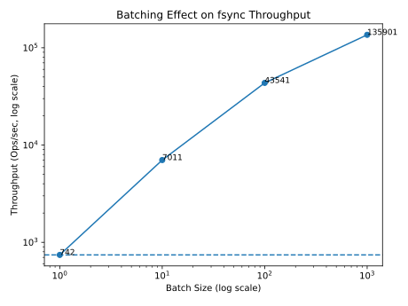

# fsync-cost

**Measuring the real cost of fsync/fdatasync on ext4 (WSL2)**

[](https://www.rust-lang.org/)
[](https://opensource.org/licenses/MIT)

This repository contains a set of micro-benchmarks to measure the performance of `fsync` and `fdatasync` under various conditions. The goal is to **quantify the durability cost** and understand the impact of batching, O_DIRECT, and metadata flushing.

## 📊 Key Findings

| Experiment | Condition | Ops/Sec | Insight |
|------------|-----------|---------|---------|
| Baseline | write + fdatasync | **742** | Raw cost of per-write fsync |
| Batch=10 | sync every 10 writes | **7,011** | 9.4x speedup |
| Batch=100 | sync every 100 writes | **43,541** | 58.7x speedup |
| Batch=1000 | sync every 1000 writes | **135,901** | **183x speedup** |
| O_DIRECT | bypass page cache | **791** | *Faster* than cached I/O on WSL2 |
| fsync | flush data + metadata | **734** | No measurable difference from fdatasync |


## 📈 Batching Effect (Measured)




### 🔍 Observations

1. **Per-write fsync is expensive**: ~1.35ms latency, limiting throughput to ~740 ops/sec.
2. **Batching works**: 1000 writes per fsync yields **180x higher throughput** — at the cost of potential data loss.
3. **O_DIRECT behaves unexpectedly on WSL2**: It's slightly *faster* than cached I/O, revealing WSL2's virtualization quirks.
4. **fsync ≈ fdatasync**: In append-only workloads without metadata changes, the extra cost is negligible.

## 🛠️ How to Run

### Prerequisites
- Rust (1.75+)
- Linux environment (WSL2, native, or VM)
- ext4 filesystem (recommended)

```bash
git clone https://github.com/otmojo/fsync-cost
cd fsync-cost

# Baseline (fdatasync per write)
cargo run --release --bin fsync-cost

# Batching (modify BATCH_SIZE in src/main_batch.rs)
cargo run --release --bin fsync-cost-batch

# O_DIRECT
cargo run --release --bin fsync-cost-odirect

# fsync (instead of fdatasync)
cargo run --release --bin fsync-cost-fsync
```

### Project Structure

```text
src/
├── main.rs              # Baseline: fdatasync per write
├── main_batch.rs        # Batching: sync every N writes
├── main_odirect.rs      # O_DIRECT mode
├── main_fsync.rs        # fsync instead of fdatasync
```

## 📈 Sample Output

```
--- Results ---
Total time: 134.843 sec
Ops/sec: 742
Avg latency: 1.348 ms
```

## 🧠 Why This Matters

Database and storage engine designers constantly juggle the trade-off between **durability** and **performance**. These experiments put concrete numbers behind that trade-off, showing exactly how much throughput you gain (and what you risk) by batching fsyncs.

## 📝 Blog Post (Japanese)

I've written a detailed [Qiita article](https://qiita.com/otmojo/items/9998fc4e927a798b4b04) (Japanese) explaining the methodology and results.

## 📄 License

MIT
